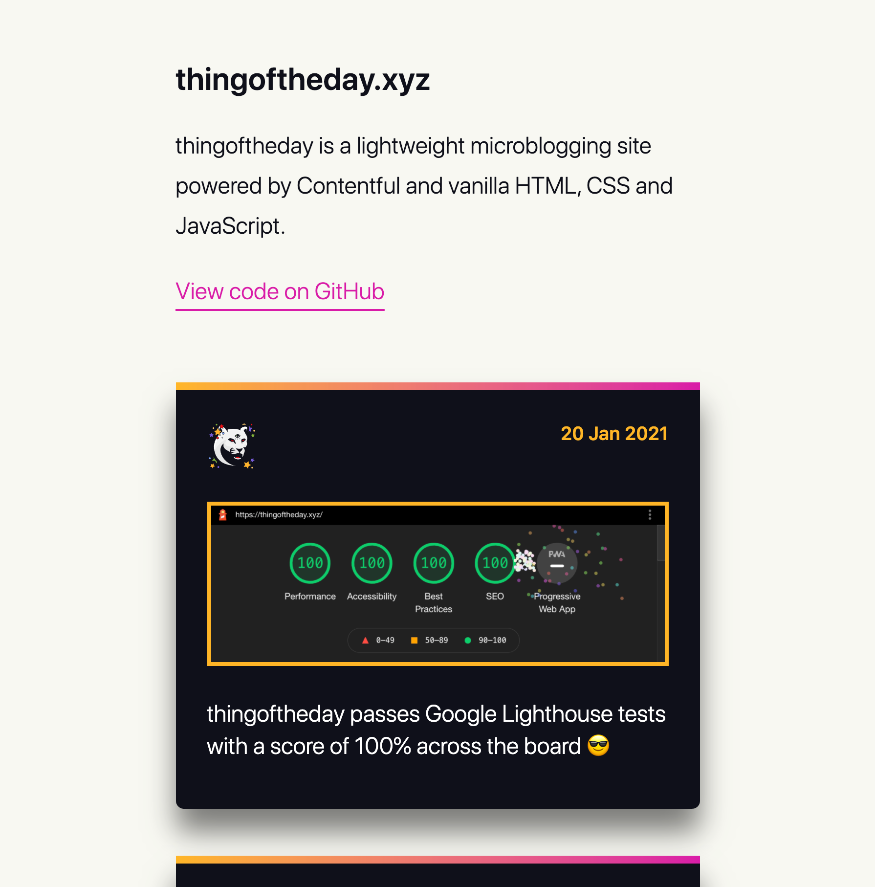

# thingoftheday

[Visit thingoftheday](https://thingoftheday.xyz/)

thingoftheday is a lightweight microblogging site powered by Contentful and vanilla HTML, CSS and JavaScript.

## Forked the repo? Here's how to get started with development

### Prerequisites

```text
Node Package Manager (npm)
```

## Running the application on your machine

thingoftheday uses no frameworks and is powered by vanilla HTML, CSS and JavaScript!

To be able to serve the JS module to the browser, you'll need to serve the files over a local http server.

[You can do this really nicely with this http-server package.](https://www.npmjs.com/package/http-server)

Install http-server globally, and start the development server locally by running:

```bash
cd path/to/repo
npx http-server
```
